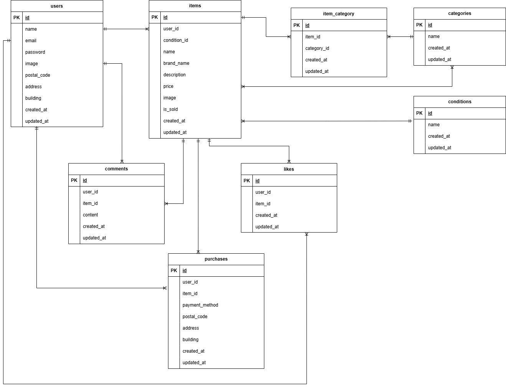

# coachtech-furima

## 環境構築

### Dockerビルド
```bash
docker compose up -d --build
```

### Laravel環境構築
```bash
docker compose exec php bash
composer install
cp .env.example .env
php artisan key:generate
php artisan migrate
php artisan db:seed
```

## 使用技術
- PHP 8.1.34
- Laravel 8.83.29
- MySQL 8.0.26
- Docker 29.6.1
- nginx 1.21.1
- phpMyAdmin 5.2.3

## ER図


## URL
- 開発環境：http://localhost:8091
- 商品一覧：http://localhost:8091/
- 会員登録：http://localhost:8091/register
- ログイン：http://localhost:8091/login
- マイリスト：http://localhost:8091/?tab=mylist
- 出品一覧：http://localhost:8091/mypage?page=sell
- 購入一覧：http://localhost:8091/mypage?page=buy
- phpMyAdmin：http://localhost:8092

## 機能一覧
- 会員登録
- ログイン・ログアウト
- 商品一覧
- 商品検索
- 商品詳細
- マイリスト
- いいね機能
- コメント機能
- 商品購入
- 配送先変更
- 商品出品
- マイページ
- プロフィール編集